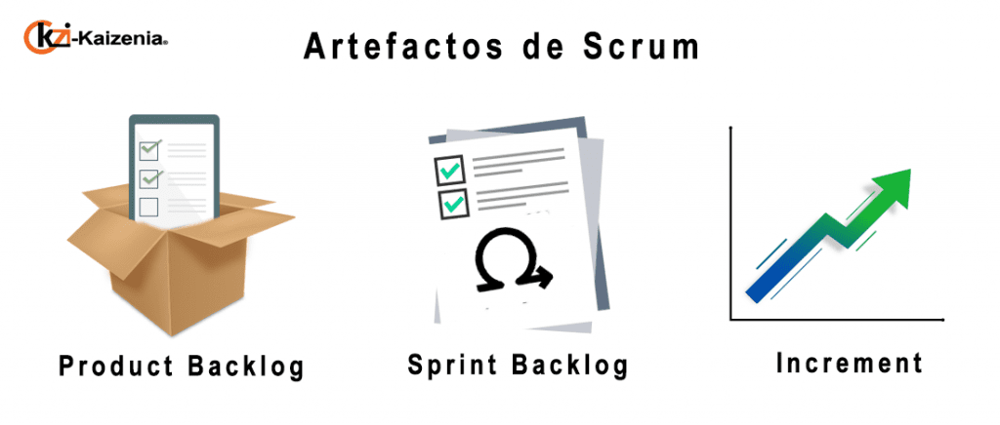
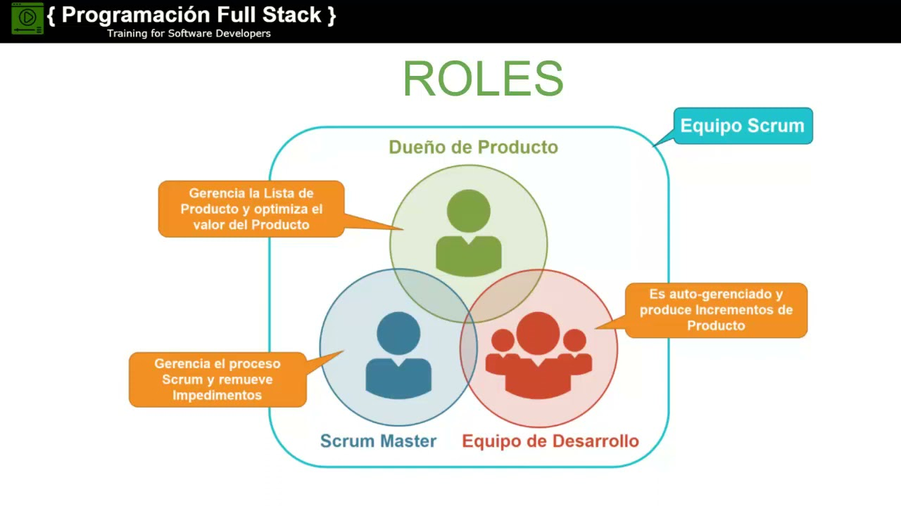

# ProgramacionISPC2022

# LAS CEREMONIAS DEL SCRUM:

*Las ceremonias que se realizan a lo largo del proyecto:*

* **Sprint Planning Meeting: (Reunión de planificacion del sprint)**  Se produce al iniciar cada Sprint y tiene por objetivo decidir que se va a realizar en el Sprint

___
* **Daily Scrum Meeting(reunión periodica)** Se produce diariamente y tiene un maximo de 20 min. de duración. Tiene por objeto tratar qué es lo que se hizo, qué se va a hacer y qué problemas se han encontrado, esto a fin de encontrar soluciones diarias

___
* **Sprint Review Meeting ( reunion de revision del Sprint)** Se produce al finalizar el Sprint y tiene por objeto mostrar qué es lo que se ha completado y qué no. Debe estar presente el Product Owner 
___
* **Sprint Retrospective Meeting(Reunión de retrospectiva del Sprint)** Se produce también al finalizar el sprint y tiene por objeto documentar qué ha funcionado y qué no ha funcionado en el Sprint. La idea de dicha reunión es centrar al equipo en lo que salió bien y en lo que debe mejorar para la proxima interación.  
___

   

# ARTEFACTOS 

Los denominados Artefactos son aquellos elementos fisicos que se producen como resultado de la aplicacion de Scrum

**Los tres principales Artefactos son**

**1.Product Backlog** 

Es un inventario que contiene cualquier tipode trabajo que haya que hacer en el producto. **Es la principal fuente de información sobre el producto en Scrum**, ya que contiene todos los requerimientos que necesitamos implementar en el producto. **Es gestionado en exclusiva por el Product Owner**, siendo su principal función la de priorizar aquellos elementos que tienen más valor en cada etapa y detallarlos para que el equipo de desarrollo sea capaz de valorarlos y ejecutarlos. 

Contiene distintos elementos:
* Funcionalidades
* Bugs
* Historia de usuario: una forma de expresar elementos de un Product Backlog. Para obtener el máximo valor de una historia es necesario expresarlas desde el punto de vista del usuario

**2. Sprint BackLog** 

Lista de elementos en los que se trabaja durante la etapa de Sprint.

Todo el trabajo que el Development Team haya seleccionado para hacer durante el siguiente Sprint pasa al Sprint Backlog. **Este artefacto es un elemento para visualizar el trabajo a realizar durante cada Sprint y está gestionado por el equipo de desarrollo**. Su propósito es mantener la transparencia dentro del desarrollo, actualizándolo durante toda la iteración especialmente a través de los daily Scrums.
Este artefacto **permite entender cuál es la evolución del trabajo durante el Sprint, así como hacer un análisis de riesgos**, permite analizar hasta donde se ha cumplido el objetivo y que se podría eliminar. De esta forma, maximizamos el retorno de la inversión en desarrollo.

**3. Incremento**

Un Incremento es el resultado del Sprint, es la suma de todas las tareas, casos de uso, historias de usuario y cualquier elemento que se haya desarrollado durante el Sprint y que será puesto a disposición del usuario final en forma de software, aportando un valor de negocio al producto que se está desarrollando.

# ROLES 

Un equipo Scrum suele estar compuesto por grupos de trabajo entre 3 a 9 mienbros del **equipo de desarrollo** más el **Scrum Master**  y el  **Product Owner**. cada uno de estos roles tiene diferentes responsabilidades y debe de reunir cuentas de distintas maneras, tanto entre ellos como para el resto de la organizacion. La suma de todos los roles es lo que llamamos **Equipo Scrum**.

## ***Product Owner***  
El Product Owner es el encargado de optimizar y maximizar el valor del producto, siendo la persona encargada de gestionar el flujo de valor del producto a través del Product Backlog. Adicionalmente, es fundamental su labor como interlocutor con los stakeholders y sponsors del proyecto, así como su faceta de altavoz de las peticiones y requerimientos de los clientes. Si el Product Owner también juega el rol de representante de negocio, su trabajo también aportará valor al producto.
Es fundamental otorgar el poder necesario al Product Owner para que este sea capaz de tomar cualquier decisión que afecte al producto. En el caso de que el Product Owner no pueda tomar estas decisiones sin consultarlas previamente con otra persona, deberá ser investido para tomarlas él mismo, o ser sustituido por esa persona. A su vez, el Product Owner debe convertirse en el altavoz del cliente, en el transmisor de las demandas y del feeback otorgado por los mismos.

## ***Scrum Master*** 

El Scrum Master tiene dos funciones principales dentro del marco de trabajo: gestionar el proceso Scrum y ayudar a eliminar impedimentos que puedan afectar a la entrega del producto. Además, se encarga de las labores de mentoring y formación, coaching y de facilitar reuniones y eventos si es necesario.

1.    Gestionar el proceso Scrum: el Scrum Master se encarga de gestionar y asegurar que el proceso Scrum se lleva a cabo correctamente, así como de facilitar la ejecución del proceso y sus mecánicas. Siempre atendiendo a los tres pilares del control empírico de procesos y haciendo que la metodología sea una fuente de generación de valor.

2.    Eliminar impedimentos: esta función del Scrum Master indica la necesidad de ayudar a eliminar progresiva y constantemente impedimentos que van surgiendo en la organización y que afectan a su capacidad para entregar valor, así como a la integridad de esta metodología. El Scrum Master debe ser el responsable de velar porque Scrum se lleve adelante, transmitiendo sus beneficios a la organización facilitando su implementación.

## ***El equipo de desarrollo***
El equipo de desarrollo suele estar formado por entre 3 a 9 profesionales que se encargan de desarrollar el producto, auto-organizándose y auto-gestionándose para conseguir entregar un incremento de software al final del ciclo de desarrollo.

El equipo de desarrollo se encargará de crear un incremento terminado a partir de los elementos del Product Backlog seleccionados (Sprint Backlog) durante el Sprint Planning.

Es importante que en la metodología Scrum todos los miembros del equipo de desarrollo conozcan su rol, siendo solo uno común para todos, independientemente del número de miembros que tenga el equipo y cuales sean sus roles internos. Cómo el equipo de desarrollo decida gestionarse internamente es su propia responsabilidad y tendrá que rendir cuentas por ello como uno solo; hay que evitar intervenir en sus dinámicas.

Habitualmente son equipos ‘cross-funcional’, capaces de generar un incremento terminado de principio a fin, sin otras dependencias externas.