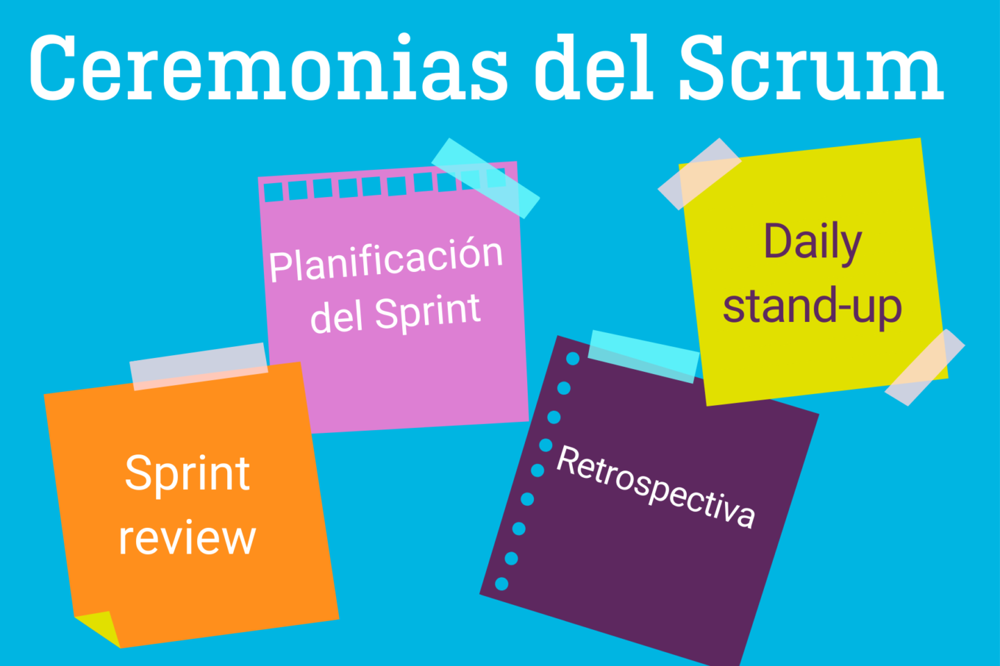

# ProgramacionISPC2022

# LAS CEREMONIAS DEL SCRUM:

*Las ceremonias que se realizan a lo largo del proyecto:*

* **Sprint Planning Meeting: (Reunión de planificacion del sprint)**  Se produce al iniciar cada Sprint y tiene por objetivo decidir que se va a realizar en el Sprint

___
* **Daily Scrum Meeting(reunión periodica)** Se produce diariamente y tiene un maximo de 20 min. de duración. Tiene por objeto tratar qué es lo que se hizo, qué se va a hacer y qué problemas se han encontrado, esto a fin de encontrar soluciones diarias

___
* **Sprint Review Meeting ( reunion de revision del Sprint)** Se produce al finalizar el Sprint y tiene por objeto mostrar qué es lo que se ha completado y qué no. Debe estar presente el Product Owner 
___
* **Sprint Retrospective Meeting(Reunión de retrospectiva del Sprint)** Se produce también al finalizar el sprint y tiene por objeto documentar qué ha funcionado y qué no ha funcionado en el Sprint. La idea de dicha reunión es centrar al equipo en lo que salió bien y en lo que debe mejorar para la proxima interación.  
___

   

# ARTEFACTOS 

# ROLES 
