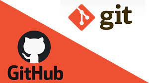

# ProgramacionISPC2022
## A- Introduccion a las Bases de Datos

### A1- Historia y Evolución de los SGBD I Y II


### A2- Sistemas Gestores de Bases de Datos
### A3- Diseño de bases de datos relacionales 


## B- Metodologías Agiles y Gestión de Proyectos

### B1- Metodologia Scrum
Scrum es un framework que permite trabajar en una serie de interacciones en equipo. Las fases que definen y en las que se divide un proceso de SCRUM son las siguientes:

• El quién y el qué: identifica los roles de cada uno de los miembros del equipo y define su responsabilidad en el proyecto.

• El dónde y el cuándo: que representan el Sprint.

• El por qué y el cómo: representan las herramientas que utilizan los miembros de Scrum.

___

### **Roles en Scrum:**


El equipo de Scrum consiste en tres diferentes roles:

El Product Owner es la “voz del cliente” y el responsable de desarrollar, mantener y priorizar las tareas en el backlog.

El Scrum Master es responsable de asegurarse que el trabajo del equipo vaya bien siguiendo las bases de Scrum. Además, se encarga de remover cualquier obstáculo que pueda encontrar el equipo de desarrollo.

Los Miembros del Equipo de desarrollo son los encargados de escribir y probar el código.

___

### **El Sprint**

El Sprint es la unidad básica de trabajo para un equipo Scrum. Esta es la característica principal marca la diferencia entre Scrum y otros modelos para el desarrollo ágil. Es una simple iteración llevada a cabo por los miembros del equipo. Un equipo puede completar varios sprints durante el desarrollo del proyecto.

Un Sprint inicia con un equipo que se compromete a realizar el trabajo y finaliza con la demostración de un entregable. El tiempo mínimo para un Sprint es de una semana y el máximo es de 4 semanas. Dentro del desarrollo de un Sprint se llevan a cabo ciertos eventos, estos reciben el nombre de Scrum Events o Eventos Scrum.
___
### **Herramientas Scrum**

 *Backlog de Producto*

Esto puede referirse a todo elemento que sea parte del proyecto: puede ser un bug, una referencia o parte de un requerimiento. Brindan información muy general del proyecto y muchas veces no son tomados como requerimientos oficiales.

 *Historias de Usuario*

Es un elemento especial del product Backlog. Se llaman historias porque en ellas se proporciona información sobre cómo debe ser el comportamiento del requerimiento que se está trabajando. Su función es proporcionar información directa del cliente en caso de existir algún cambio. Generalmente estos sí son tomados como requerimientos oficiales.

 *Backlog del Sprint*

Es el conjunto de elementos tomados del Product Backlog que fueron priorizados, medidos y aceptados en las reuniones de Sprint Planning. Estos, en conjunto con sus respectivos User Stories, forman oficialmente los requerimientos a elaborar en cada uno de los Sprints que tendrá el proyecto.

 *El panel de Tareas*
Este panel muestra las tareas que tienen asignadas los miembros del equipo. Esta tabla se divide en tres columnas que representan el estado de la actividad:

* Por hacer.

* Haciendo.

* Terminado.

Al inicio del Sprint todas están en la primer columna. Cuando una tarea pasa a la segunda columna, el Scrum Master y el Product Owner son notificados respecto a qué está haciendo cada miembro del equipo y cuánto tiempo lleva trabajando en dicha tarea. Al finalizarla, esta debe cambiarse a la última columna. Esto quiere decir que está listo para que QA haga las pruebas necesarias.

___
### **Fases de Scrum**

 *1 - Planeación del Sprint*

Todos los involucrados en el equipo se reúnen para planificar el Sprint. Durante este evento se decide qué requerimientos o tareas se le asignará a cada uno de los elementos del equipo. Cada integrante deberá asignar el tiempo que crea prudente para llevar a cabo sus requerimientos. De esta manera se define el tiempo de duración del Sprint.

 *2 - Reunión de equipo de Scrum*

A estas reuniones se les deberían dedicar máximo 15 minutos diarios, y deberían ser siempre en el mismo horario y lugar. En ellas, cada miembro del equipo deberá responder tres simples preguntas:

* ¿Qué hiciste ayer?
* ¿Qué tienes planeado hacer hoy?
* ¿Qué obstáculos encontraste en el camino?

Estas reuniones sirven para que todos los miembros del equipo se apoyen entre ellos. Si alguno de ellos tiene algún inconveniente que obligue a extender el encuentro, este debe tratarse más a fondo en una reunión enfocada en buscar la mejor solución para ello.

 *3 - Refinamiento del Backlog*

El Product Owner revisa cada uno de los elementos dentro del Product Backlog con el fin de esclarecer cualquier duda que pueda surgir por parte del equipo de desarrolladores. También sirve para volver a estimar el tiempo y esfuerzo dedicado a cada uno de los requerimientos.

 *4 - Revisión del Sprint*

Los miembros del equipo y los clientes se reúnen para mostrar el trabajo de desarrollo de software que se ha completado. Se hace una demostración de todos los requerimientos finalizados dentro del Sprint. En este punto no es necesario que todos los miembros del equipo hablen, pueden simplemente estar presentes, pero la presentación está a cargo del Scrum Master y el Product Owner.

 *5 - Retrospectiva del Sprint*

En este evento el Product Owner se reúne con todo su equipo de trabajo y su Scrum Master para hablar sobre lo ocurrido durante el Sprint. Los puntos principales a tratar en esta reunión son:

* Qué se hizo mal durante el Sprint para poder mejorar el próximo.
* Qué se hizo bien para seguir en la misma senda del éxito.
* Qué inconvenientes se encontraron y no permitieron poder avanzar como se tenía planificado.
### B2- GITHUB- VSC


Es una plataforma de social coding GitHub dónde puedes publicar repositorios de código remotos que pueden trabajarse con el sistema de control de versiones Git, dado que está integrado.
Este sistema ofrece la posibilidad de colaborar en proyectos como publicar proyectos propios. 

**Crear Cuenta** 

* Acceder a https://github.com/ y luego, clic en el botón Sign up. 

* Seleccionar el plan personal gratuito con repositorio público y se siguen  las instrucciones. La verificación es  mediante correo electrónico.

* Crear un proyecto en la opción **create a proyect**. Incluir nombre del repositorio y seleccionar la opcion Create repository.

**Crear Repositorio**
Accede a la cuenta de github y luego, se hace clic en el menú ubicado en la parte superio y seleccionar "new repository" del menu conceptual y completar el formulario. 

**Clonar el repositorio en Visual Studio Code**
Dentro de Git debemos definir nuestro usuario e email de la siguiente manera:

$git config --global user.name "tunombre"

$git config --global user.email tuemail@dominio.com

Desde **visual Studio Code** ir al menu "view" seleccionamos "comand palete". En ese punto buscamos "git: Clone".
La herramienta nos pedira la ruta y ahi es donde tenemos que pegar la URL del repositorio que hemos creado en Github. Antes de hacer un commit debemos instalar la extensión "github pull request" desde el menú view/terminal. Además hay que autorizar nuestra cuenta github en Visual Studio Code.Para ello, en la barra inferior de Visual Studio y presionar el icono de git e introductor la cuenta github. 

Desde la pestaña de Git podemos hacer el "commit"de los ficheros. En primer lugar, incluiremos los ficheron a los que queremos hacer stage pulsando el "+" o "todos". 
Para hacer el push hay dos maneras:
* pulsar en la parte derecha de la barra de git y elegir la opcion push o pull.
* pulsar en la parte inferior sobre sincronizar 

Para solucionar errores en command"git.clone" not found debemos instalar GIT e indicar por linea de comandos nuestro usuario e email:

$git config --global user.name "Nombre"

$git config --global user.email tumail@dominio.com


### B3- GIT y GITHUB
**Sistema de Control de Versiones**
___
Git es un **sistema de control de versiones(vsc)** distribuido gratuito y de código abierto diseñado para manejar desde proyectos pequeños a muy grandes, con velocidad y eficiencia.
* Nos permite conocer los cambios realizados en los programas o software que vamos desarrollando con el paso del tiempo. Administrar las distintas versiones. 
* Nace como necesidad de control para Kernel de Linux
* Coordinar el trabajo entre los diferentes desarrolladores del equipo 
* Repositorios local y remotos.


**git** es un sistema de control de versiones distribuido(DVSC en ingles)

**VENTAJAS**
* Sistema distribuido, que permite el trabajo incluso son conexión.
* Super rápido y ligero, optimizado para hacer operaciones de control muy rápidas.
* Crear ramas y mezclarlas poco propenso a problemas.
* La integridad de la información está asegurada gracias a su modelo de almacenamiento, que permite predecir este tipo de problemas.
* Permite flujos de trabajo muy flexibles.
* El concepto de área de preparación o staging permite versionar los cambios como nos convenga, no todo o nada. 
* Operaciones Locales 
* Copias instantáneas

**Instalacion git**
___
[InstacionGit.com](https://www.youtube.com/watch?v=7qzV04C5S-k "Como instalar git")


### B4- GIT
Git es una herramienta que realiza una función del control de versiones de código de forma distribuida, de la que destacamos varias características:
* Es muy potente
* Fue diseñada por Linus Torvalds
* No depende de un repositorio central
* Es software libre
* Con ella podemos mantener un historial completo de versiones
* Podemos movernos, como si tuviéramos un puntero en el tiempo, por todas las revisiones de código y desplazarnos una manera muy ágil.
* Tiene un sistema de trabajo con ramas que lo hace especialmente potente
* En cuanto a la funcionalidad de las ramas, las mismas están destinadas a provocar proyectos divergentes de un proyecto principal, para hacer experimentos o para probar nuevas funcionalidades.
* Las ramas pueden tener una línea de progreso diferente de la rama principal donde está el core de nuestro desarrollo. En algún momento podemos llegar a probar algunas de esas mejoras o cambios en el código y hacer una fusión a nuestro proyecto principal, ya que todo esto lo maneja Git de una forma muy eficiente.

**Secciones principales de un proyecto Git**
* Confirmado: tenemos un fichero con el que hemos estado trabajando, hemos aprobado todos sus cambios y va en una nueva revisión, es decir, una especie de paquete dónde van todos los cambios.
* Modificado: estamos trabajando en el directorio de trabajo (o working directory) y consideramos que ese cambio debe de ir en una revisión, en esa especie de paquete, para formar la revisión.
* Preparado: hemos marcado un archivo para que vaya una revisión.


Fundamentalmente, un proyecto Git se estructura en tres partes o tres cajas:

* El área del working directory, que es dónde vamos a tener todos nuestros ficheros, dónde estamos trabajando constantemente.
* El staging area, que es donde van los archivos que estamos modificando y que aceptamos para que vayan en una futura revisión.
* El área de commit o el git directory, que es dónde se almacenan la revisión completa. A lo largo de nuestro curso de Git, se explicará cómo podemos movernos a lo largo de esos tres estados, para qué sirven y por qué suponen una ventaja.

**Resumen**


## C- Ética y Deontología Profesional
### C1. Introduccion
### C2- Ética en la informática

[](https://postimg.cc/DJQmK4gY)

La ética es una disciplina filosófica que se define como "principios directivos que
orientan a las personas en cuanto a la concepción de la vida, el hombre, los juicios, los
hechos, y la moral”.
La tecnología informática plantea nuevas situaciones y nuevos problemas y gran parte de
estas nuevas situaciones y problemas son de una naturaleza ética; obviamente existen intentos
de resolver estos problemas aplicando las actuales reglas y soluciones éticas de carácter
general.
1.1. Definición.
La ética en la informática es una nueva disciplina que pretende abrirse campo dentro
de las éticas aplicadas por lo cual encontramos varias definiciones.
 Se define "como la disciplina que analiza los problemas éticos que son creados por la
tecnología de los ordenadores o también los que son transformados o agravados por la
misma". Es decir, por las personas que utilizan los avances de las tecnologías de la
información.
 "Es el análisis de la naturaleza y el impacto social de la tecnología informática y la
correspondiente formulación y justificación de políticas para un uso ético de dicha
tecnología", esta definición esta relacionada con los problemas conceptuales y los
vacíos en las regulaciones que ha ocasionado la tecnología de la información.
 También se define a la EI "como la disciplina que identifica y analiza los impactos de
las tecnologías de la información en los valores humanos y sociales" . Estos valores
afectados son: la salud, la riqueza, el trabajo, la libertad, la democracia, el conocimiento,
la privacidad, la seguridad o la autorrealización personal.

Los diez mandamientos de la ética informática.
1) No usarás una computadora para dañar a otros.
2) No interferirás con el trabajo ajeno.
3) No indagarás en los archivos ajenos.
4) No utilizarás una computadora para robar.
5) No utilizarás la informática para realizar fraudes.
6) No copiarás o utilizarás software que no hayas comprado.
7) No utilizarás los recursos informáticos ajenos sin la debida autorización.
8) No te apropiarás de los derechos intelectuales de otros.
9) Deberás evaluar las consecuencias sociales de cualquier código que desarrolles.
10) Siempre utilizarás las computadoras de manera de respetar los derechos de los demás.

### C3- Moral vs Ética
[](https://postimg.cc/yk0KpCLv)

Ambos términos se usan de manera indistinta como si abarcarán el mismo significado
pero no lo son.
La ética es una rama de la filosofía y la moral forma parte de la vida diaria. Algunos
autores la comparan con la teoría y la práctica. La ética seria la moral pensada, mientras
que la moral sería la moral vivida. Se trata de dos conceptos distintos, con diferentes
etimologías y usos tanto en la vida privada como en la profesional y con distintos alcances
en los múltiples planos de la sociedad contemporánea.
Ética; Búsqueda del bien, de la realización personal en armonía con los seres humanos e
implica una relación dinámica entre nuestros valores y los de la sociedad que nos haya
tocado vivir.
“Ética Nicómaco“ La felicidad es el fin último de todo ser humano y la ética nos enseña
cómo alcanzarla” Aristóteles. Pensadores contemporáneos como Fernando Savater, este
sigue siendo el objetivo de la ética.
La ética intenta responder en la teoría y la practica la pregunta de cómo debemos vivir, y
desde un punto de vista académico, es la rama de la filosofía que estudia los principios
morales, lo que es bueno y malo

### C4- Dilema en las Redes Sociales 


### D- PYTHON

### D-1 Introducción a Python 

Python es un lenguaje de programación de alto nivel cuya máxima es la legibilidad del código. Fue creado por Guido van Rossum y lanzado en 1991. Las principales características de Python son las siguientes

1) Es multiplataforma: Se puede encontrar un intérprete de Python para los principales sistemas operativos: Windows, Linux y Mac OS. Además, se puede reutilizar el mismo código en cada una de las plataformas.
2) Es dinámicamente tipado: Es decir, el tipo de las variables se decide en tiempo de ejecución.
3) Es fuertemente tipado: No se puede usar una variable en un contexto fuera de su tipo. Si se quisiera, habría que hacer una conversión de tipos.
4) Es interpretado: El código no se compila a lenguaje máquina.

####D-2 Se utiliza para:

* Desarrollo web (Lado del servidor)
* Desarrollo de Software
* Matemáticas
* Secuencia de Comandos del Sistema

####  Podemos hacer ciertas cosas con el lenguaje como:

En Python se puede usar en un servidor para crear aplicaciones web.
Se puede usar junto con el software para crear flujos de trabajo. Puede conectarse a sistemas de bases de datos.
También puede leer y modificar archivos. Puede usarse para manejar big data y realizar operaciones matemáticas complejas.
Se puede utilizar para la creación rápida de prototipos o para el desarrollo de software listo para la producción.

Es posible escribir Python en un entorno de desarrollo integrado, como Thonny, Pycharm, Netbeans, Eclipse, Visual studio Code, Sublime Text, Google Colaboraty, que son particularmente útiles cuando se administran colecciones más grandes de archivos de Python.

### D-2 Tipos de Datos

Esta se divide en 2 grupos, tenemos los básicos y complejos

#### Los tipos de datos **básicos** en Python son:

#### Número Entero (int):
Este tipo de dato se corresponde con números enteros, es decir, sin parte decimal.

```py
entero = 80
```

#### Número Decimal (float)
Este tipo de dato se corresponde con números reales con parte decimal. Cabe destacar que el separador decimal en Python es el punto (.) y no la coma (,).

```py
decimal = 6.14159
```

#### Caracter (chr):
Este tipo de dato se corresponde con un símbolo tipográfico, es decir, una letra, número, coma, espacio, signo de punutación, etc.

```py
caracter = 'Q'
```

#### Cadena de Texto (str):
Este tipo de datos se corresponde con una cadena de caracteres.

```py
cadena = 'Análisis Numérico'
```

#### Booleano (bool)
Este tipo de dato reconoce solamente dos valores: Verdadero (True) y Falso (False)

```py
booleano = True
```

#### D-3 Los tipos de datos **complejos** en Python son:

#### Listas
Se trata de conjuntos ordenados de elementos, encerrados por corchetes y separados por comas. El orden comienza con el índice 0 para el primer lugar de la Lista. Pueden agruparse valores de distintos tipos de datos básicos, y es posible agregar, eliminar o modificar elementos de las listas en cualquier momento.

```py
    lista = [10,20,30,40]
    print(lista)
    print(lista[0])

    [10, 20, 30, 40]
    10

    lista[1] = 25
    print(lista)
    
    [10, 25, 30, 40]

    sublista = lista[1:3]
    print(lista)
    print(sublista)
    print(lista[:-1])

    [10, 25, 30, 40]
    [25, 30]
    [10, 25, 30]
```

#### Tuplas
Las Tuplas son básicamente Listas de elementos estáticas, es decir, que no pueden modificarse (decimos que las Tuplas son inmutables en Python). Para su definición, en lugar de corchetes se encierran valores separados por comas entre paréntesis.

```py
    tupla = (6, 7, 8,9)
    print(tupla)
    print(tupla[0])

    (6, 7, 8, 9)
    6

    subtupla = tupla[1:3]
    print(tupla)
    print(subtupla)
    print(tupla[:-1])

    (6, 7, 8, 9)
    (7, 8)
    (6, 7, 8)
```

La similitud entre **Listas** y **Tuplas** es tan explícita que se puede bloquear una lista transformándola en una tupla con la función tuple() o bien desbloquear una tupla para transformarla en una lista con la función list()

```py
    print(tuple(lista))
    print(list(tupla))

    (10, 25, 30, 40)
    [6, 7, 8, 9]
```
#### D-4 Diccionarios

En los Diccionarios cada elemento se compone de un par clave-valor, y para su definición es necesario encerrar los elementos entre llaves. Es posible acceder a un valor utilizando su clave, pero no al revés. Por este motivo, no se pueden repetir las claves para elementos distintos, pero sí es posible agregar, eliminar o modificar valores

```py
    diccionario = {"Codigo":7512,"Materia":"Análisis Numérico I"}

    print(diccionario)
    
    {'Codigo': 7512, 'Materia': 'Análisis Numérico I'}

    print(diccionario["Codigo"])
    print(diccionario["Materia"])
    
    7512
    Análisis Numérico I
```

#### D-5 VALORES BOOLEANOS EJECUCION CONDICIONAL EN BUCLES PYTHON
1. Los operadores de comparación (o también denominados operadores relacionales) se utilizan para comparar valores.

**Ejemplo**
```py
x == y  # False
x == z  # True
```

2. Cuando deseas ejecutar algún código solo si se cumple una determinada condición, puedes usar una sentencia condicional:

**Una única sentencia if, por ejemplo:**
```py
x = 10

if x == 10: # condición
    print("x es igual a 10")  # Ejecutado si la condición es Verdadera.
```

**Una serie de sentencias if, por ejemplo:**
```py
x = 10

if x > 5: # primera condición
    print("x es mayor que 5")  # Ejecutado si la primera condición es Verdadera.

if x < 10: # segunda condición
    print("x is less than 10")  # Ejecutado si la segunda condición es Verdadera.

if x == 10: # tercera condición
    print("x is equal to 10")  # Ejecutado si la tercera condición es Verdadera.
 ```
 Cada sentencia if se prueba por separado.
 
**Una sentencia de if-else, por ejemplo:**

```py
x = 10

if x < 10:  # Condición
    print("x es menor que 10")  # Ejecutado si la condición es Verdadera.

else:
    print("x es mayor o igual a 10")  # Ejecutado si la condición es Falsa.
```

**Una serie de sentencias if seguidas de un else, por ejemplo:**

```py
x = 10

if x > 5:  # True
    print("x > 5")

if x > 8:  # True
    print("x > 8")

if x > 10:  # False
    print("x > 10")

else:
    print("se ejecutará el else")
```
Cada if se prueba por separado. El cuerpo de else se ejecuta si el último if es False.

**La sentencia if-elif-else, por ejemplo**

```py
x = 10

if x == 10:  # True
    print("x == 10")

if x > 15:  # False
    print("x > 15")

elif x > 10:  # False
    print("x > 10")

elif x > 5:  # True
    print("x > 5")

else:
    print("else no será ejecutado")
```
Si la condición para if es False, el programa verifica las condiciones de los bloques elif posteriores: el primer elif que sea True es el que se ejecuta. Si todas las condiciones son False, se ejecutará el bloque else.

**Sentencias condicionales anidadas, ejemplo:**

```py
x = 10

if x > 5:  # True
    if x == 6:  # False
        print("anidado: x == 6")
    elif x == 10:  # True
        print("anidado: x == 10")
    else:
        print("anidado: else")
else:
    print("else")

```


 

